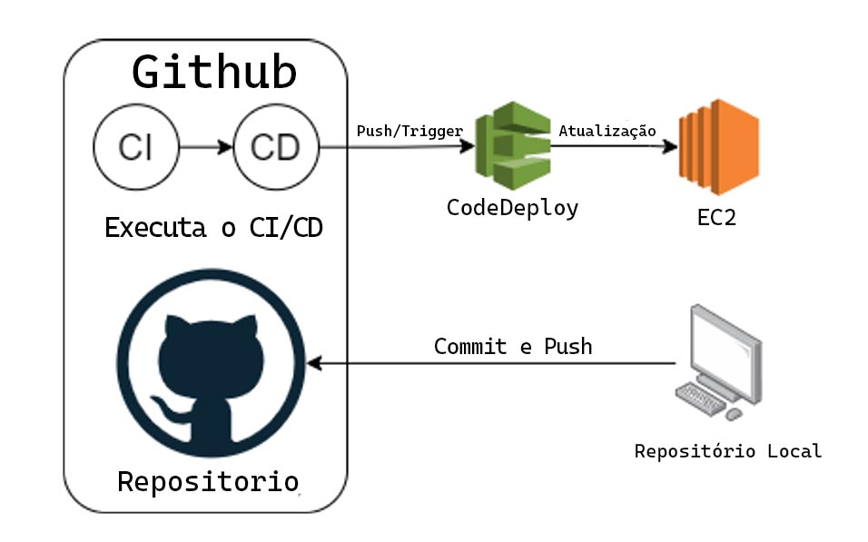

<h1 align='center'>Deploy na AWS (EC2/CodeDeploy) usando um runner self-hosted
  
  
  
</h1> 

## Url da aplicação

<http://44.197.177.204/>

### Resultado do Deploy no CodeDeploy

## O CI/CD

Ferramentas CI/CD usadas nesse repositorio:
- **GitHub Actions** realiza o build e test unitário (CI)
- **AWS CodeDeploy:** automatiza todo o deploy na aws EC2 (CD)

